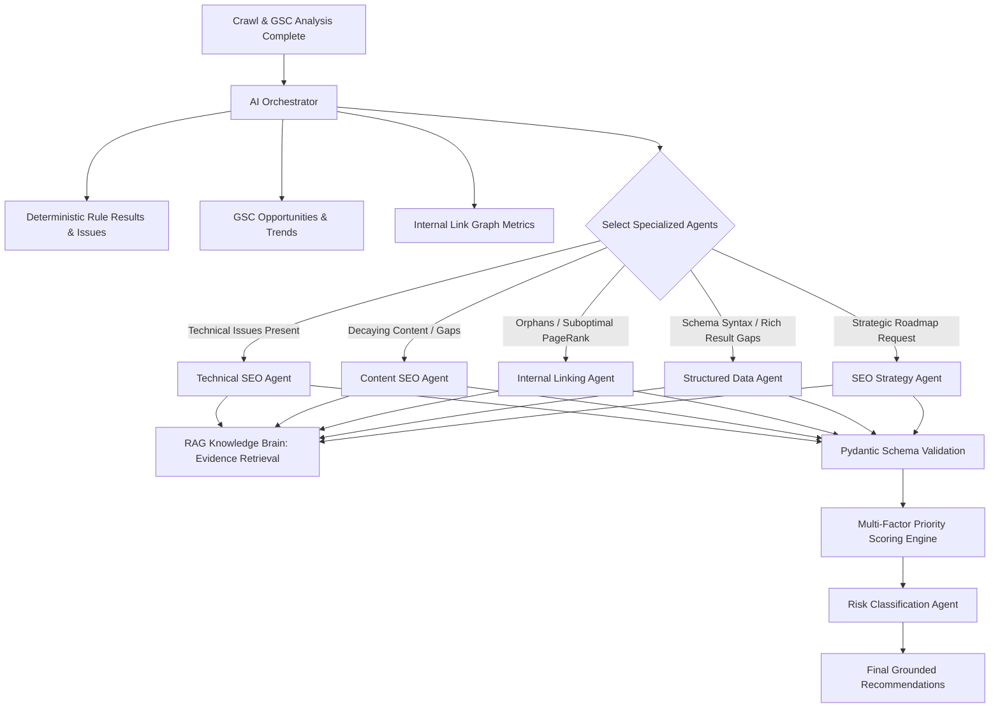

# AI AGENT ARCHITECTURE SPECIFICATION
## Autonomous AI SEO Platform

### 1. Architectural Philosophy
The AI layer functions strictly as an **evidence-driven reasoning system**. It never invents technical facts.
The multi-agent system is organized under an **Orchestrator Pattern**. Large monolithic prompts and unnecessary multi-agent cascades per page are strictly banned to control costs and eliminate latency.



---

### 2. Specialist Agent Roster

#### 2.1. Technical SEO Agent
- **Inputs:** Crawl issues, status codes, canonical chains, robots directives, server vs rendered DOM diffs, RAG documentation evidence.
- **Responsibilities:** Diagnoses root causes (e.g., conflicting canonical in JavaScript hydration vs HTTP header).
- **Output:** Concrete technical diagnoses, evidence citations, step-by-step resolution steps.
- **Temperature:** `0.1` (deterministic, highly conservative).

#### 2.2. Content SEO Agent
- **Inputs:** Main body text, search queries with high impressions/declining CTR, keyword cannibalization clusters.
- **Responsibilities:** Evaluates search intent alignment, semantic entity coverage, and information gain.
- **Safety & YMYL Guardrails:**
  - Health, finance, legal, and safety (YMYL) content is permanently marked `HUMAN_REVIEW_REQUIRED`.
  - Strictly rejects spam generation tactics (no doorway pages, no city-swapping variations, no programmatic thin content).
- **Temperature:** `0.3 - 0.5`.

#### 2.3. Internal Linking Agent
- **Inputs:** Directed link graph, page depth, PageRank importance, weak high-value pages, contextual body text.
- **Responsibilities:** Identifies semantic link placement opportunities connecting authoritative pages to orphan/weak pages.
- **Guardrail:** The agent is strictly prohibited from inventing paragraphs; recommendations must pinpoint existing sentences in the source page for anchor embedding.
- **Temperature:** `0.2`.

#### 2.4. Structured Data Agent
- **Inputs:** Raw JSON-LD scripts, Microdata, page schema types, Google Search Central rich result specifications.
- **Responsibilities:** Fixes schema syntax errors, maps missing required fields for target rich result eligibility.
- **Zero-Hallucination Mandate:** The agent is strictly forbidden from fabricating facts (e.g., fake reviews, aggregate ratings, business hours, prices, or author credentials). Any property added must exist visibly on the rendered page.
- **Temperature:** `0.0`.

#### 2.5. Strategy & Prioritization Agent
- **Inputs:** Site-wide health score, crawl budget waste, GSC search trends, business-critical page flags.
- **Responsibilities:** Synthesizes isolated findings into cohesive 30, 60, and 90-day prioritized roadmaps.
- **Guardrail:** Explicitly prohibited from giving ranking guarantees (e.g., "This change will move you to position #1").
- **Temperature:** `0.3`.

---

### 3. Priority Scoring Formula
Recommendations are ranked using a deterministic multi-factor priority algorithm:

$$\text{Priority Score} = \frac{\text{Impact} \times \text{Confidence} \times \text{Reach} \times \text{Business Value} \times \text{Risk Modifier}}{\text{Effort}}$$

Where:
- **Impact:** 1 (Minor UX) to 5 (Site-wide Crawl/Index Blocker)
- **Confidence:** 0.0 to 1.0 (Calibrated from deterministic evidence + RAG ground truth)
- **Reach:** Logarithmic scale based on affected page impressions or URL count
- **Business Value:** Configured weight (1.0 = Default, 3.0 = High-converting Money Page, 0.5 = Utility Page)
- **Risk Modifier:** Critical = 0.2 (Downweights automatic urgency, mandates review), Low = 1.0
- **Effort:** 1 (Trivial text tweak) to 5 (Full architectural refactoring)
- **Normalized Output:** 0 to 100 integer score.

---

### 4. Structured Output Contract (Pydantic Models)

All agent responses must pass strict Pydantic validation:

```python
from pydantic import BaseModel, Field
from typing import List, Optional, Dict, Any

class GroundedCitation(BaseModel):
    source_id: str
    document_title: str
    canonical_url: str
    excerpt: str

class RecommendationOutput(BaseModel):
    title: str = Field(..., max_length=120)
    category: str
    problem_diagnosis: str
    proposed_solution: str
    technical_reason: str
    confidence: float = Field(ge=0.0, le=1.0)
    expected_impact: str
    effort: str = Field(..., regex="^(LOW|MEDIUM|HIGH)$")
    risk_level: str = Field(..., regex="^(INFO|LOW|MEDIUM|HIGH|CRITICAL)$")
    citations: List[GroundedCitation]
    diff_preview: Optional[Dict[str, Any]] = None
```

---

### 5. Human Feedback & Reinforcement Loop
Every recommendation in the UI includes actionable feedback options for site owners:
- `USEFUL` (Approved for execution or acknowledged)
- `INCORRECT` (Flags deterministic check or RAG discrepancy)
- `OUTDATED` (Triggers knowledge freshness review)
- `TOO_RISKY` (Adjusts tenant risk sensitivity weights)
- `ALREADY_FIXED` (Triggers immediate re-crawl)

Feedback is stored in the `learning_dataset` to continuously calibrate priority and confidence weights.
