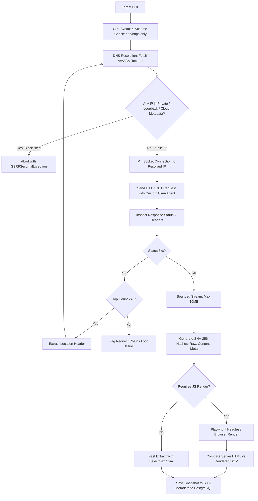

# CRAWLER ENGINE SPECIFICATION
## Autonomous AI SEO Platform

### 1. Architectural Mission & Capabilities
The crawler is the high-performance data acquisition backbone of the platform. It reliably discovers, fetches, renders, extracts, and normalizes site structure, headers, and DOM content at scale while guaranteeing absolute network safety and polite crawl behavior.

---

### 2. Crawl Modes & Identities

| Crawl Mode | User-Agent Identifier | Robots.txt Adherence | Scope & Use Case |
|---|---|---|---|
| `GOOGLEBOT_SIMULATION` | `Mozilla/5.0 (compatible; Googlebot/2.1; +http://www.google.com/bot.html)` | **STRICT.** Completely obeys Disallow, Crawl-delay, and user-agent matching for Googlebot. | Accurately models Googlebot's accessibility, crawl budget, and indexation potential. |
| `OWNER_AUDIT` | `AutonomousAI-SEO-Auditor/1.0 (+https://platform.example.com/bot)` | Configurable; may audit staging / authenticated URLs if domain ownership is verified. | Comprehensive internal site audits for site owners (disallowed pages flagged as warnings, not omitted). |

*Note: Reports must clearly distinguish "Crawlable by Googlebot" from "Accessible to Owner Audit Crawler".*

---

### 3. URL Normalization Engine

URL normalization guarantees duplicate URLs with trivial syntactic differences are mapped to a canonical identifier:

1. **Protocol & Host:** Lowercase protocol (`https://`) and punycode-normalized lowercase host (`example.com`).
2. **Default Ports:** Strip default port numbers (`:80` for HTTP, `:443` for HTTPS).
3. **Trailing Slashes:** Standardize according to directory conventions without breaking non-slash routes.
4. **Fragments:** Remove URL fragments (`#section`) completely as fragments are not sent in HTTP requests.
5. **Non-crawlable Schemes:** Automatically discard `mailto:`, `tel:`, `javascript:`, `data:`, `ftp:`.
6. **Query Parameter Handling:**
   - **DO NOT** blindly strip query parameters. Parameters like `?page=2`, `?category=shoes`, and `?id=492` produce distinct indexable content.
   - Strip known tracking / marketing query parameters (`utm_*`, `fbclid`, `gclid`, `mc_eid`).
   - Alphabetically sort remaining query parameters (`?b=2&a=1` -> `?a=1&b=2`) to eliminate duplicate cache keys.

---

### 4. Fetch Pipeline & SSRF Protection Lifecycle

---

### 5. Politeness & Concurrency Engine
Aggressive crawling can crash client web servers or trigger Cloudflare/WAF IP bans.
- **Per-Domain Rate Limiting:** Token-bucket rate limiter enforcing configurable requests per second (default: 2 req/sec per domain).
- **Concurrency Cap:** Maximum 3 concurrent worker connections per target host.
- **HTTP 429 & 503 Handling:** Exponential backoff with jitter (`backoff_factor = 2`, `max_delay = 60s`).
- **Robots.txt Crawl-Delay:** Respects `Crawl-delay:` directive when specified.
- **Circuit Breaker:** If a domain returns consecutive 5xx errors exceeding threshold (10 consecutive errors), pause crawl job and flag warning.

---

### 6. HTML Extraction Pipeline
For every fetched page, the following metadata points are deterministically extracted:
- **Title Tag:** Raw text, length, duplicate instances.
- **Meta Directives:** Meta description, viewport, charset, robots (`noindex`, `nofollow`, `noarchive`, `noimageindex`).
- **HTTP Headers:** `X-Robots-Tag`, `Content-Language`, `Cache-Control`, `Location`, `Content-Type`.
- **Headings:** Complete ordered array of `<h1>` through `<h6>` with inner text.
- **Links:** Internal and external hyperlinks, `href`, anchor text, `rel` attributes (`nofollow`, `sponsored`, `ugc`).
- **Images:** Image `src`, `srcset`, `alt` attribute, native `loading` attribute, dimensions.
- **Structured Data:** Embedded `<script type="application/ld+json">`, Microdata, and RDFa payloads.
- **Main Content Body:** Extracted using Readability/Trafilatura heuristic, stripping navigation, headers, and footers.
- **Word Count:** Clean visible body text token count.

---

### 7. Conditional JavaScript Rendering Engine
Headless browsers consume 50x more memory and CPU than asynchronous HTTP clients.
- **Default Strategy:** 90%+ of pages are parsed directly from fast HTTP responses using `Selectolax`.
- **Render Trigger Heuristics (Playwright activated ONLY when):**
  1. Main content body contains fewer than 30 words in raw HTML, but scripts like React/Next.js/Vue bundles are detected.
  2. The page is an SPA with `

` or `

` with empty body children.
  3. Site configuration explicitly enables full JavaScript rendering for SPA targets.
- **Comparison Engine:** When rendered, the system computes differences:
  - Title/Meta changes between server response and DOM.
  - Links injected exclusively via JavaScript.
  - Structured data injected exclusively via JavaScript.
