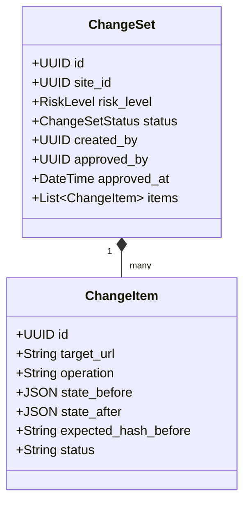
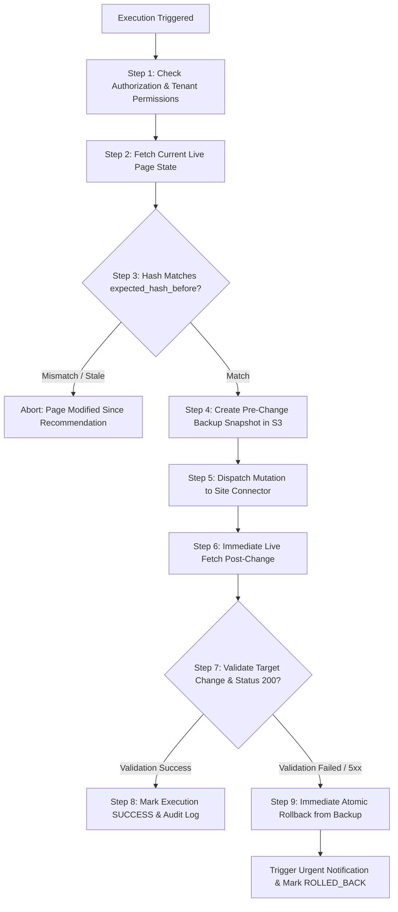

# EXECUTION AND ROLLBACK ENGINE SPECIFICATION
## Autonomous AI SEO Platform

### 1. Architectural Mission
The Execution and Rollback Engine bridges the gap between passive SEO audits and active website optimization. Because incorrect technical SEO changes (such as faulty canonical tags or erroneous `noindex` directives) can destroy organic search traffic within hours, this engine enforces **absolute reversibility, optimistic concurrency, pre-change backups, and deterministic post-write validation**.

---

### 2. Execution Modes & Autonomous Boundaries

Sites configure one of four operational modes:

1. **`SUGGEST_ONLY`:** The platform acts strictly as an auditor. Changes are generated as diffs, but write operations are disabled.
2. **`REVIEW_ALL` (Default):** Every proposed change requires explicit manual review and cryptographic approval by an authorized user (`OWNER` or `SEO_MANAGER`).
3. **`AUTO_LOW_RISK`:** Changes classified as `LOW` risk (e.g., adding missing image `alt` attributes, adding meta descriptions) execute automatically. All other tiers require human approval.
4. **`AUTO_LOW_AND_APPROVED_MEDIUM`:** Low-risk changes execute automatically; Medium-risk changes execute automatically only after an organization-level approval rule is satisfied.

**Permanent Constraint:** `HIGH` and `CRITICAL` risk actions (canonical changes, `robots.txt` modifications, `noindex` additions/removals, redirect rules, URL deletions) **can never be executed autonomously**, regardless of configuration.

---

### 3. ChangeSet & ChangeItem Data Model

Every mutation is encapsulated in an atomic `ChangeSet`:



---

### 4. Step-by-Step Safe Mutation Lifecycle

The executor strictly follows this 9-step atomic execution sequence:



---

### 5. Site Connector Architecture

Connectors implement the unified `SiteConnector` interface:

```python
from abc import ABC, abstractmethod
from typing import Dict, Any, List

class SiteConnector(ABC):
    @abstractmethod
    async def verify_connection(self) -> bool:
        """Verifies API credentials, reachable endpoint, and permissions."""
        pass

    @abstractmethod
    async def get_capabilities(self) -> List[str]:
        """Returns supported features: e.g. CAN_EDIT_TITLE, CAN_EDIT_SCHEMA, CAN_EDIT_ROBOTS."""
        pass

    @abstractmethod
    async def read_page_state(self, url: str) -> Dict[str, Any]:
        """Reads current live state for concurrency check."""
        pass

    @abstractmethod
    async def apply_change(self, change_item: Dict[str, Any]) -> bool:
        """Applies mutation to CMS or repository."""
        pass

    @abstractmethod
    async def rollback_change(self, backup_state: Dict[str, Any]) -> bool:
        """Restores the pre-change backup state."""
        pass
```

#### 5.1. Initial Connector Adapters

1. **`WordPressConnector`:**
   - Connects via WordPress REST API with Application Passwords.
   - Enforces least privilege (editor role).
   - Manipulates post metadata, title, content blocks, and Yoast/RankMath meta fields without raw theme file mutation.
2. **`GitBasedConnector`:**
   - For Jamstack, Astro, Next.js, and static site repos (GitHub / GitLab).
   - **Never pushes directly to `main` or production.**
   - Creates a dedicated branch (`seo-fix/change-123`), commits JSON/Markdown/HTML diffs, and opens a Pull Request with complete before/after visual diffs and justification evidence.
3. **`GenericWebhookConnector`:**
   - For custom CMS integration.
   - Dispatches signed HTTPS webhooks using HMAC-SHA256 signatures.
   - Enforces timestamp validation (`X-Timestamp` within 5 minutes) and idempotency keys (`X-Idempotency-Key: UUID`) to prevent replay attacks.

---

### 6. Side-by-Side Diff UI Specification
Before confirming any execution, the user is presented with a structured Diff Preview:
- **Target URL:** Canonical page path.
- **Side-by-Side Visual Diff:** Green additions / Red deletions.
- **Operational Action:** e.g., `REPLACE_TITLE`, `INJECT_JSON_LD`.
- **Reason & Evidence:** The deterministic crawl issue that necessitated this fix.
- **Estimated Risk & Impact:** Risk level badge (`INFO`, `LOW`, `MEDIUM`, `HIGH`, `CRITICAL`).
- **One-Click Revert Button:** Available on all completed execution records.
