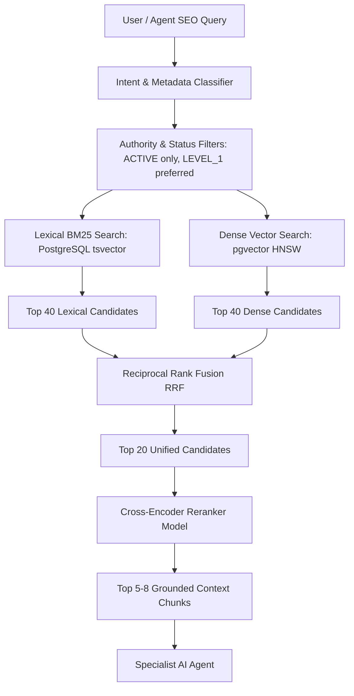

# RAG ARCHITECTURE SPECIFICATION
## Autonomous AI SEO Platform

### 1. Architectural Mission
The SEO Knowledge Brain provides the foundational authoritative knowledge that guides AI reasoning. LLMs frequently hallucinate outdated practices or popular SEO myths. The Knowledge Brain guarantees that any claim, strategy, or policy statement is strictly grounded in official search standards.

---

### 2. Authority Levels & Document Governance

Knowledge sources are stratified into four strict authority tiers:

| Tier | Category | Sources | Usage Policy |
|---|---|---|---|
| **LEVEL_1_OFFICIAL** | Search Engine & Web Standards | Google Search Central, Search Console API, CrUX documentation, W3C, WHATWG, IETF RFCs, Sitemaps.org, Schema.org | **Primary Source of Truth.** Required for all technical fact claims and policy checks. |
| **LEVEL_2_HIGH_QUALITY** | Peer-Reviewed & Standards Groups | Academic information retrieval papers, Chromium developer docs, web.dev core engineering | Secondary guidance on performance and system mechanics. |
| **LEVEL_3_INDUSTRY** | Reputable Industry Case Studies | Large-scale empirical studies from trusted technical practitioners | Heuristics and tactical guidance; explicitly marked as empirical observation. |
| **LEVEL_4_COMMUNITY** | Forum & Community Discussions | Reddit, SEO forums, social discussions | Monitored for emerging anomalies; **forbidden** from serving as policy citations. |

---

### 3. Core Seed Inventory (Level 1 Official)
The initial ingestion pipeline incorporates:
1. Google Search Essentials (formerly Webmaster Guidelines)
2. Google Spam Policies
3. Google SEO Starter Guide
4. Google Crawling & Indexing Documentation
5. Google Robots Exclusion Protocol Specification
6. Google Canonicalization & Duplicate Content Guidance
7. Google Sitemaps XML Protocol & Index Documentation
8. Google JavaScript SEO Guidance (Dynamic Rendering vs SSR/Hydration)
9. Google Structured Data & Rich Results Guidelines
10. Google Title Links & Snippet Control Guidance
11. Google Search Console API & URL Inspection Documentation
12. Chrome User Experience Report (CrUX) Specification
13. Core Web Vitals Metric Definitions (LCP, INP, CLS)
14. Google Generative AI Content & Search Guidance
15. Schema.org Core Specification & Release Vocabulary

---

### 4. Semantic Chunking Strategy
Naïve fixed-character chunking (e.g., 500 characters) destroys hierarchical context in technical documentation.

**Chunking Algorithm:**
1. **Document Structure Parsing:** Parse markdown or HTML structure preserving heading tags (`H1` -> `H2` -> `H3`).
2. **Context Path Construction:** Every chunk stores its hierarchical path: e.g., `["Crawling and Indexing", "Robots.txt", "Allow and Disallow Directives"]`.
3. **Chunk Boundary:** 300 to 800 tokens per chunk, targeting natural section endings or subheadings.
4. **Overlap Window:** 50 to 100 tokens overlapping adjacent chunks to retain cross-boundary discourse.
5. **Metadata Tagging:** Source ID, authority tier, canonical URL, language, document version, and last verified timestamp.

---

### 5. Hybrid Retrieval Pipeline (Lexical + Dense + Reranking)

Literal technical tokens such as `noindex`, `301`, `canonical`, `INP`, `CLS`, `Hreflang`, and `robots.txt` frequently suffer from semantic embedding drift when searched purely through dense vector cosine distance. Therefore, a **Hybrid Retrieval** architecture is enforced:

#### 5.1. Reciprocal Rank Fusion (RRF) Formula
Candidates from lexical and dense queries are merged using standard RRF:
$$RRF(d) = \sum_{m \in M} \frac{1}{k + r_m(d)}$$
where $k = 60$, and $r_m(d)$ is the rank of document chunk $d$ in system $m$ (lexical or dense).

#### 5.2. Cross-Encoder Reranker
The top 20 fused candidates are processed through a lightweight cross-encoder (e.g., `bge-reranker-large` or hosted provider equivalent) which evaluates pairwise query-document relevance, outputting calibrated probability scores between 0.0 and 1.0.

---

### 6. Freshness & Deprecation Engine
Search guidelines evolve continuously. A recommendation based on deprecated guidance can harm site rankings.
- **Continuous Ingestion Cron:** Crawls official source sitemaps/RSS weekly.
- **Hash Comparison:** Compares `sha256(content)`. If changed:
  - Archives previous version (`status = 'HISTORICAL'`).
  - Sets previous chunks to inactive.
  - Ingests, chunks, and embeds new version (`status = 'ACTIVE'`).
- **Deprecation Flagging:** If an API or feature is retired by Google (e.g., `Preferred Domain` in GSC, legacy AMP requirements), the document is updated to `status = 'DEPRECATED'`.
- **Query Filter:** The retrieval engine injects `WHERE status = 'ACTIVE'` to guarantee deprecated instructions never surface in active recommendations.

---

### 7. Evaluation & Groundedness Metrics
Release gating requires automated evaluation against a benchmark dataset of 100+ golden SEO policy questions:
- **Retrieval Metrics:**
  - `Recall@5` >= 0.85
  - `Mean Reciprocal Rank (MRR)` >= 0.90
  - `Normalized Discounted Cumulative Gain (nDCG@5)` >= 0.88
- **Generation Metrics:**
  - `Groundedness Score`: Fraction of generated claims directly supported by cited chunk text (target: 100%).
  - `Citation Accuracy`: Verifying cited source IDs actually match the claimed policy.
  - `Myth Rejection`: Verifying the model explicitly refutes common myths when prompted with leading queries.
