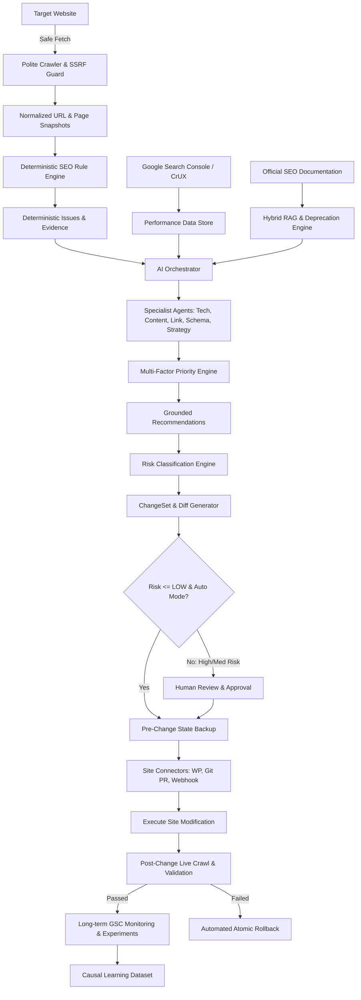

# SYSTEM ARCHITECTURE SPECIFICATION
## Autonomous AI SEO Platform (SEO Operating System)

### 1. Executive Summary
The Autonomous AI SEO Platform is designed not merely as a dashboard or content generator, but as a production-grade, highly resilient **SEO Operating System**. It strictly separates factual, deterministic engineering checks from probabilistic, generative AI reasoning. The architecture enforces zero-hallucination policies for technical facts, strict SSRF/prompt injection boundaries, multi-tenant isolation, and reversible safe execution.

---

### 2. Core Philosophy & Intelligence Hierarchy
The system strictly operates on the following precedence order:
1. **Facts:** HTTP status, canonicals, robots.txt, sitemaps, headers, DOM structure (Deterministic code validation).
2. **Deterministic Rules:** 20+ rule categories evaluated with zero AI hallucination risk.
3. **Real Performance Data:** Google Search Console API, CrUX field data, Lighthouse lab runs.
4. **Trusted Knowledge:** Curated SEO Knowledge Brain with Level-1 official documentation (Google Search Central, schema.org, W3C, RFCs).
5. **Hybrid RAG:** BM25 lexical search + dense pgvector embeddings + reciprocal rank fusion + cross-encoder reranking.
6. **AI Orchestration & Specialist Agents:** Technical SEO, Content Quality, Internal Link Graph, Structured Data, Strategy, and Risk agents.
7. **Human / Risk Governance:** Guardrails preventing automated writes on HIGH/CRITICAL actions, mandatory backups, and diff preview.
8. **Site Connectors:** WordPress, Git PRs, and Generic HMAC-signed Webhooks with optimistic concurrency.
9. **Measurement & Continuous Learning:** 28/56/90-day causal impact analysis separating algorithm updates/seasonality from platform changes.

---

### 3. Service Catalog (32 Core Services)

| # | Service Name | Responsibilities |
|---|---|---|
| 1 | **Web Application** | Next.js App Router frontend, Tailwind CSS, TanStack Query, accessible UI components. |
| 2 | **API Gateway / API** | FastAPI async REST API (`/api/v1`), Pydantic validation, CORS, rate limits. |
| 3 | **Authentication Service** | JWT, argon2/bcrypt password hashing, OAuth2 flows, session handling. |
| 4 | **Organization/Tenant Service** | Multi-tenant organization boundaries, team memberships, RBAC. |
| 5 | **Site Management Service** | Domain registration, site type classification, verification state, CMS type. |
| 6 | **Site Verification Service** | DNS TXT, HTML verification file, meta tag, and Search Console ownership verification. |
| 7 | **Crawler Service** | Asynchronous HTTP crawler, politeness, rate limiting, and robots.txt evaluation. |
| 8 | **JavaScript Renderer** | Playwright fallback engine invoked only when JS hydration/DOM alteration is detected. |
| 9 | **SEO Rule Engine** | 20+ deterministic rule evaluators with verified evidence structures. |
| 10 | **Site Graph Engine** | NetworkX directed graph analysis (PageRank, click depth, orphan detection, clusters). |
| 11 | **Search Console Integration** | GSC OAuth2 sync, Search Analytics dimension tracking, URL Inspection quota handling. |
| 12 | **CrUX Integration** | Chrome UX Report API sync for p75 field Core Web Vitals (LCP, INP, CLS). |
| 13 | **Lighthouse Integration** | Lab performance, accessibility, and best practices automated audits. |
| 14 | **RAG Knowledge System** | Curated Level 1-4 knowledge store, chunking, pgvector, lexical index, reranker. |
| 15 | **AI Orchestrator** | Coordinates specialist agents, prevents token waste, validates JSON schemas. |
| 16 | **Technical SEO Agent** | Analyzes crawl facts, status codes, canonicals, and provides grounded diagnosis. |
| 17 | **Content SEO Agent** | Evaluates search intent, content decay, information gain, and YMYL safety. |
| 18 | **Internal Linking Agent** | Semantic anchor suggestions connecting high-value hubs to orphan/weak pages. |
| 19 | **Structured Data Agent** | Validates schema.org syntax, Google Rich Result eligibility, hallucination defense. |
| 20 | **SEO Strategy Agent** | High-level 30/60/90-day action roadmaps and thematic opportunities. |
| 21 | **Risk Engine** | Classifies actions into INFO, LOW, MEDIUM, HIGH, CRITICAL risk tiers. |
| 22 | **Change Planner** | Generates atomic ChangeSets, JSON patches, and side-by-side Diff previews. |
| 23 | **Site Executor** | Dispatches changes to site connectors with optimistic concurrency control. |
| 24 | **Rollback System** | Immediate automated or manual rollback using pre-change state snapshots. |
| 25 | **Experiment Engine** | 28/56/90-day page cohort experiments with control groups (diff-in-diff). |
| 26 | **Learning Dataset** | Event-sourced log of features, recommendations, actions, and empirical outcomes. |
| 27 | **Scheduler Service** | Cron and interval triggers for recrawls, GSC syncs, and knowledge freshness checks. |
| 28 | **Background Worker** | Async job queue (Redis + Arq) handling long-running crawl and AI jobs. |
| 29 | **Notification System** | Alerts on critical crawl errors, high-risk approval requests, and traffic anomalies. |
| 30 | **Audit Logs Service** | Immutable ledger of user actions, approvals, site mutations, and execution results. |
| 31 | **Observability Service** | Structured logging, OpenTelemetry tracing spans, metrics tracking, health checks. |
| 32 | **Admin Console** | Platform administration, feature flags, knowledge source sync, tenant oversight. |

---

### 4. Data Flow & Execution Pipelines

#### 4.1. Crawl & Normalization Pipeline
1. Seed URLs obtained (homepage, sitemap index, GSC known pages).
2. URL Normalization: scheme, port, lowercase hostname, path canonicalization, query parameter sorting (stripping tracking fragments, preserving functional params like `page`).
3. SSRF & DNS Rebinding Filter: Target IP resolved and checked against RFC 1918, RFC 3927, loopback, and metadata ranges.
4. HTTP Fetch: Asynchronous HTTPX client with politeness delay, exponential backoff, and max size limits.
5. DOM Parser (selectolax/lxml): Title, meta robots, canonical, headings, links, structured data extracted.
6. Conditional Render: If content is thin or SPA signatures are detected, trigger Playwright renderer and store DOM diff.
7. Snapshot & Hash: Store `raw_html_hash`, `main_content_hash`, and metadata in database; archive HTML in Object Storage (MinIO/S3).

#### 4.2. RAG Knowledge & Grounding Pipeline
1. Official sources (Google Search Central, schema.org) ingested with source metadata, authority level (1-4), and retrieved timestamp.
2. Semantic chunking (300-800 tokens) retaining heading hierarchy.
3. Hybrid Search: Dense embedding search (`pgvector` HNSW cosine distance) + Lexical full-text search (`tsvector` BM25 ranking).
4. Reciprocal Rank Fusion (RRF) merges candidate lists (top 40).
5. Cross-encoder reranks top candidates down to 5-10 final context chunks.
6. Deprecation Filter: Documents marked `DEPRECATED` or `REMOVED` are excluded from recommendation generation.

#### 4.3. Site Mutation & Rollback Pipeline
1. Recommendation generated with evidence and risk rating.
2. If Risk is HIGH/CRITICAL (canonical, noindex, robots.txt, redirects, page deletion), execution blocks until human owner approves.
3. Optimistic Concurrency Check: Fetch current live page state; verify current content hash matches the recommendation baseline.
4. Pre-write Backup: Capture live snapshot before mutation.
5. Connector Execution: Apply change via WordPress REST, Git Pull Request, or HMAC-signed webhook.
6. Immediate Post-Change Crawl: Fetch live page, verify HTTP status 200, verify target change is reflected, and ensure no critical regressions.
7. If validation fails: trigger immediate atomic rollback and notify tenant admins.

---

### 5. Multi-Tenancy & Security Boundaries
- **Tenant Isolation:** Every relational query filters by `organization_id`. PostgreSQL Row Level Security (RLS) is applied on tenant tables.
- **Untrusted Web Content:** All crawled HTML/text is treated as `UNTRUSTED_CONTENT`. It is isolated in system prompts with strict XML/markdown boundaries and stripped of instruction execution privileges.
- **Secrets at Rest:** OAuth tokens, CMS passwords, and webhook signing secrets are AES-256-GCM encrypted at rest using keys managed via environment/KMS.
